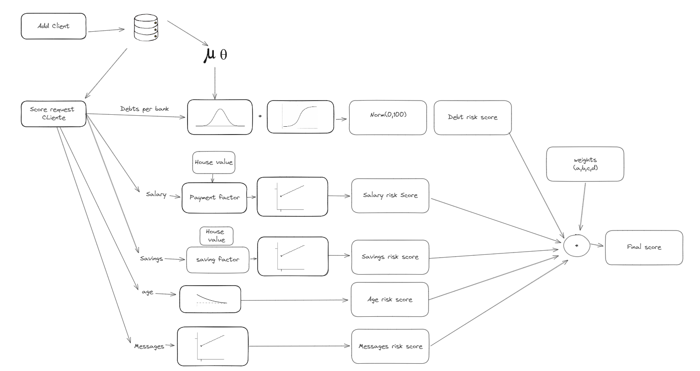

# Lidz Challenge

## Requisitos
- Docker
- Docker Compose

## Instrucciones

1. **Clonar el repositorio:**
    ```bash
    git clone https://github.com/jmbustos1/lidz-challenge
    ```

2. **Crear archivo .env para pruebas en local:**
    ```bash
    cp env.example.txt .env
    ```

3. **Crear la imagen:**
    ```bash
    sudo docker build .
    ```

4. **Levantar contenedores:**
    ```bash
    sudo docker compose up
    ```
5. **Ingresar al contenedor de Django:**
    ```bash
    sudo docker exec -it lidz-django /bin/bash
    ```
6. **Realizar migraciones:**
    ```bash
    python manage.py migrate
    ```

7. **Poblar base de datos:**
    ```bash
    python manage.py db_data
    ```

8. **Probar endpoint:**
    ```bash
    curl http://localhost:8000/clients
    ```

# Diseño de score
